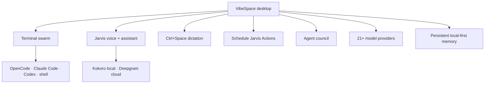
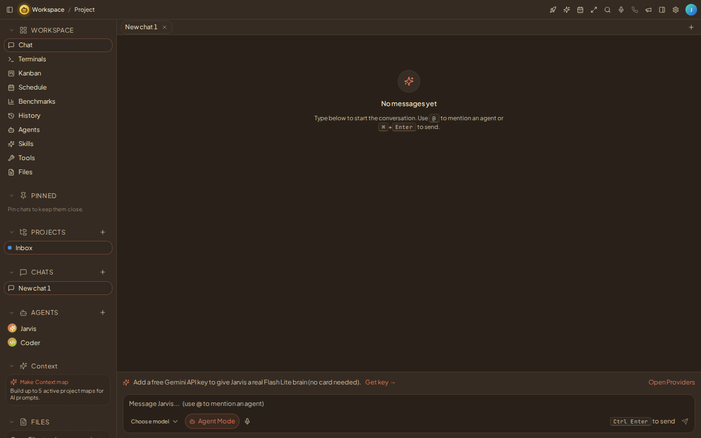
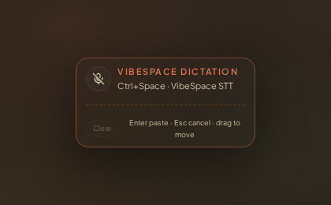
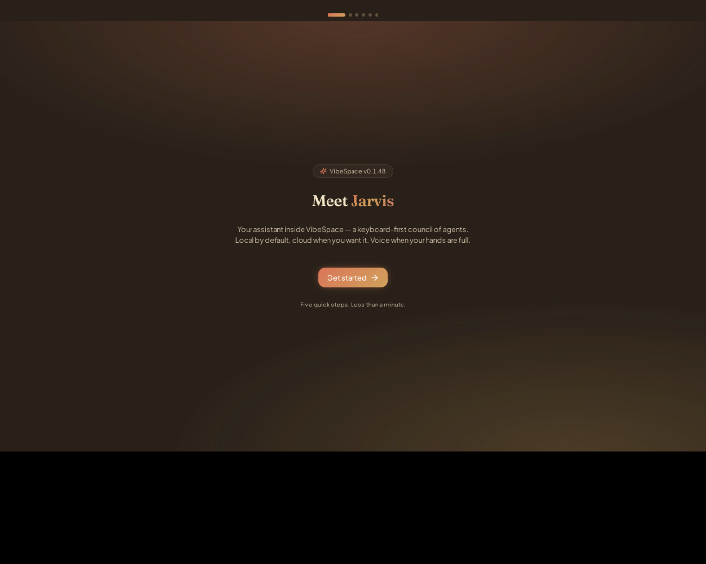
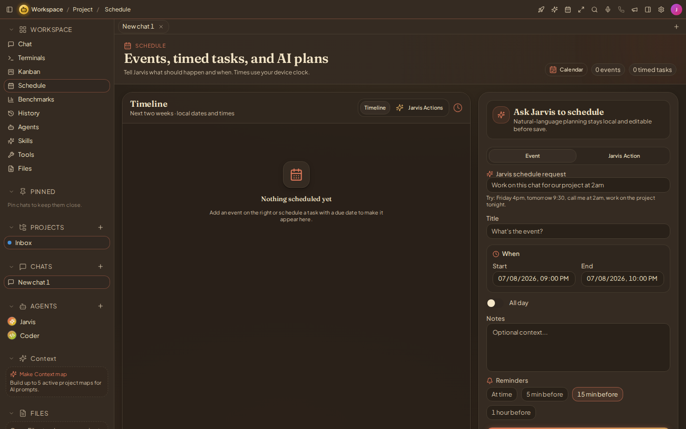
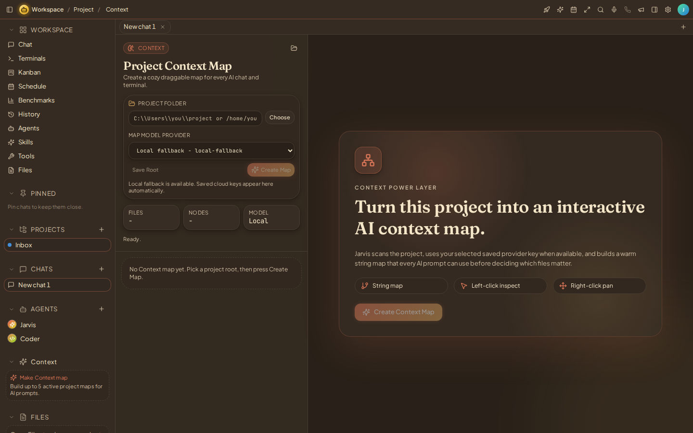

<div align="center">


# VibeSpace

**The AI workspace where every model, agent, voice, and task lives under one roof.**

*Chat with every model, convene agent councils, code in terminal swarms, talk hands-free,
schedule AI actions, and keep everything in one local-first memory.*

> **VibeSpace** is the desktop app. **Jarvis** is the built-in assistant *inside* it —
> voice, command bar, actions, and calling. Jarvis is not the product name.

<br/>

[](https://git.io/typing-svg)

<br/>

[](https://github.com/Cookie774-GameDev/VibeSpace/actions/workflows/ci.yml)
[](CHANGELOG.md)
[](https://github.com/Cookie774-GameDev/VibeSpace/releases/latest)
[](LICENSE)

[](#install)
[](#install)
[](#install)
[](https://github.com/Cookie774-GameDev/VibeSpace/stargazers)

<br/>

**[⬇ Download latest](https://github.com/Cookie774-GameDev/VibeSpace/releases/latest)** ·
**[📦 Install guide](#install)** ·
**[🖼 Screenshots](#product-preview)** ·
**[🛠 Developer setup](#developer-setup)** ·
**[🌐 Website](https://vibespaceos.com/)** ·
**[▶ Live demo](https://cookie774-gamedev.github.io/VibeSpace/)**

</div>

---

## Quick navigation

| [Overview](#what-you-get) | [Screenshots](#product-preview) | [Features](#features-at-a-glance) | [Dictation](#voice-to-text--ctrlspace-dictation) | [Install](#install) | [Security](#security--privacy) | [Dev setup](#developer-setup) | [Testing](#testing-status) | [Roadmap](#roadmap--honest-gaps) |
|---|---|---|---|---|---|---|---|---|

---

## What you get



<table>
<tr>
<td align="center" width="25%"><strong>🖥️ Terminals</strong><br/>Live PTY grid · agent CLIs<br/>one-approval orchestration</td>
<td align="center" width="25%"><strong>🎙️ Jarvis voice</strong><br/>Local Kokoro · hands-free<br/>stop-mid-reply orb</td>
<td align="center" width="25%"><strong>⌨️ Ctrl+Space</strong><br/>Dictation in-app and<br/>into any desktop app</td>
<td align="center" width="25%"><strong>🗓️ Jarvis Actions</strong><br/>Scheduled prompts that<br/>actually run &amp; save output</td>
</tr>
</table>

---

## Product preview

> Every image below is **real app media**. Workspace shots are captured from the actual app
> bundle with [`scripts/capture-screenshots.mjs`](scripts/capture-screenshots.mjs); the
> onboarding shot is from the real Linux desktop (Tauri) build. Desktop-only surfaces are
> captured on real machines — workflow in [`docs/MEDIA_CAPTURE.md`](docs/MEDIA_CAPTURE.md).

<p align="center">

</p>

<table>
<tr>
<td width="50%">

<p align="center"><strong>Ctrl+Space dictation</strong> — VibeSpace STT, never Win+H</p>
</td>
<td width="50%">

<p align="center"><strong>Desktop build</strong> — real Tauri app, first launch</p>
</td>
</tr>
<tr>
<td width="50%">

<p align="center"><strong>Schedule &amp; Jarvis Actions</strong> — outputs open in-page</p>
</td>
<td width="50%">

<p align="center"><strong>Context Map</strong> — project folders become AI context</p>
</td>
</tr>
<tr>
<td width="50%">

<p align="center"><strong>Terminal grid</strong> — live PTYs + agent CLIs</p>
</td>
<td width="50%">

<p align="center"><strong>Jarvis voice</strong> — personas, Kokoro local, Deepgram cloud</p>
</td>
</tr>
</table>

<details>
<summary><strong>More screenshots</strong> — voice engines, plans</summary>
<br/>


</details>

### Video demos

No videos are committed yet — we don't fake media. The exact capture workflow (targets:
Ctrl+Space dictation in-app and into Notepad/VS Code, the Jarvis stop-response orb, a
scheduled Jarvis Action firing, the 10-terminal orchestration approval card, Context Map
node inspection, and the website "Call Jarvis" demo) lives in
[`docs/MEDIA_CAPTURE.md`](docs/MEDIA_CAPTURE.md).

---

## Features at a glance

**Status legend:** ✅ Ready (code-complete, covered by the automated suite) ·
🖥️ **Desktop validation needed** (works in code/tests; needs real mic/OS pass) · 🔭 Planned

| Feature | What it does | Status | Notes |
|---|---|---|---|
| **Chat + Composer** | Streaming chat with every wired provider, model picker, attachments, slash commands, queued messages | ✅ Ready | Mock provider works with zero keys |
| **Jarvis Voice** | Hands-free or push-to-talk, personas, stop-mid-reply orb, visible paused state | 🖥️ Desktop validation | Needs a real microphone pass |
| **Ctrl+Space Dictation** | Focus-aware: dictates into the focused in-app input, or a small overlay pastes into external apps | 🖥️ Desktop validation | Shared chat STT pipeline · never Win+H |
| **Kokoro local voice** | ~89 MB neural TTS, downloads once on first use, runs on-device, free on every plan | 🖥️ Desktop validation | Checksum-verified, resumable download |
| **Hive pipeline** | Multi-model sequential refinement (Hive Balanced), chat-only | ✅ Ready | Hosted path needs a paid plan; BYOK works |
| **Council mode** | Side-by-side agent panels with broadcast + synthesize | ✅ Ready | Requires 2+ agents (guided if missing) |
| **Agents / Subagents** | Create agents with a step-by-step wizard; `/multitask` + `/subagents` panels with real statuses | ✅ Ready | Panel groups agents vs subagents |
| **Skills** | Reusable instruction bundles, `/skills` picker, markdown editor with safe preview | ✅ Ready | |
| **Schedule Jarvis Actions** | Scheduled prompts that execute on their saved model; outputs open inside Schedule; recurrence + dedupe | ✅ Ready | Runs while the app is open |
| **Terminals** | 10-pane PTY grid, persistence, one-approval multi-terminal orchestration with AGENTS.md briefings | 🖥️ Desktop validation | PTYs need the desktop app |
| **Context Map** | Interactive AI map of a project folder; attaches to chat, informs terminal agents | ✅ Ready | Full file access needs the desktop app |
| **Ollama / local models** | API-first connect (no tray needed), model list, pull progress, offline routing | 🖥️ Desktop validation | Daemon paths verified live; inference needs real hardware |
| **Plugins** | GitHub, Figma, Supabase, Shopify, Slack + mock implemented; real connection tests | ✅ Ready | Catalog extras are generic/configurable — no fake connected states |
| **Settings** | 15+ sections, persisted, honest unavailable states, OS keychain for keys on desktop | ✅ Ready | |
| **Billing / Plans** | Stripe checkout + customer portal via authenticated edge functions; server-enforced budgets | 🖥️ External verification | App-side flow inspected; dashboard/server verification pending |
| **AI calling (Jarvis Call)** | In-app WebRTC + real phone calls via Twilio cloud | 🔭 Server hardening | Needs phone-jarvis plan enforcement deploy |
| **Security / Privacy** | Local-first storage, key redaction, approval-gated actions | ✅ Ready | See [Security & privacy](#security--privacy) |

---

## Voice-to-text — Ctrl+Space dictation

One hotkey, focus-aware, fully VibeSpace-owned:

| Where you are | What happens |
|---|---|
| **Inside VibeSpace** (composer, agent prompts, settings fields) | Dictation goes **straight into the focused input** — no floating overlay over the app |
| **Outside VibeSpace** (browser, VS Code, Notepad, games) | A **small VibeSpace overlay** listens, transcribes, and pastes into the focused app where OS input permissions allow |

- **Shared STT pipeline** — both paths use the same engines as VibeSpace chat:
  local faster-whisper → built-in speech recognition → Deepgram → Groq
  (order follows Settings → Speech to Text)
- **Never Win+H** — VibeSpace does not route dictation through Windows default dictation
- **Real states** — listening, transcribing, pasting, error — with Retry/Clear and clear
  fix paths for missing keys, mic permission, or paste failures
- **Composer mic** — `Ctrl+CapsLock` or the composer mic button dictates into the chat
  input with live partial transcripts

---

## Install

> [!NOTE]
> **Release status:** the latest published installers are **v0.1.45**; source is at
> **v0.1.48**. New signed Windows/macOS binaries are pending — the one-line installers
> always fetch the newest *published* release. Windows builds ship with updater
> signatures; Authenticode/notarization for public distribution is still in progress
> (see [Roadmap](#roadmap--honest-gaps)).

<table>
<tr>
<th width="50%">Windows 10/11</th>
<th width="50%">macOS 12+ / Linux</th>
</tr>
<tr>
<td>

```powershell
irm https://raw.githubusercontent.com/Cookie774-GameDev/VibeSpace/main/install/install.ps1 | iex
```

Silent per-user NSIS install + `Jarvis` terminal command.

</td>
<td>

```bash
curl -fsSL https://raw.githubusercontent.com/Cookie774-GameDev/VibeSpace/main/install/install.sh | bash
```

macOS: DMG → `~/Applications`. Linux: AppImage → `~/.local/bin` + menu entry
(`JARVIS_FORMAT=deb|rpm` for native packages).

</td>
</tr>
</table>

Or grab installers directly from the **[latest release](https://github.com/Cookie774-GameDev/VibeSpace/releases/latest)**
— `.exe`, `.msi`, `.dmg`, `.deb`, `.rpm`, AppImage — and verify against `SHA256SUMS.txt`
(details + troubleshooting in [DOWNLOAD.md](DOWNLOAD.md)).

---

## Launch status

Honest, current state of the codebase and validation:

| Area | Status |
|---|---|
| Typecheck · tests · builds · installers · secret scans | ✅ Passing (see [Testing status](#testing-status)) |
| Linux install + desktop boot | ✅ Verified — AppImage install, plus the real Tauri build booted and ran in a Linux VM |
| Windows install + GUI | 🖥️ Hardware validation needed (scripts parse-validated; asset URLs verified) |
| macOS install + GUI | 🖥️ Hardware validation needed (install script dry-run + DMG SHA-256 verified) |
| Real-microphone voice & dictation | 🖥️ Hardware validation needed |
| Ollama inference | 🖥️ Real desktop needed (daemon API verified live; inference crashed only in the CI sandbox) |
| Code signing / notarization | 🔭 Pending before public binaries |
| Supabase / Stripe server-side | 🔭 App-side flow inspected in code; external dashboard verification pending |

---

## Security & privacy

- **Local-first** — chats, tasks, schedules, terminals, and settings live in IndexedDB/Dexie
  on your machine; cloud sync is opt-in
- **API keys** — stored in the OS keychain on desktop (session-only memory in browser
  preview); never logged, never sent to terminals, redacted in the dev console
- **Dictation** — no Win+H dependency; audio goes only to the STT engine your settings
  selected (local engines keep it on-device); no raw microphone audio is stored
- **Approval-gated actions** — destructive Jarvis actions (terminal orchestration, file
  writes, schedules) show approval cards; decline does nothing; malformed plans fail closed
- **Terminal safety** — agent briefings are delivered through `AGENTS.md` files, never
  typed into your shell; scrollback is sanitized and bounded
- **Payments** — no Stripe secrets in the frontend; checkout/portal run through
  authenticated Supabase Edge Functions; webhooks verify signatures with idempotency
- **Markdown safety** — skill previews escape all HTML and only allow safe image schemes

---

## Developer setup

**Prerequisites:** Node 20+, Rust 1.85+, and the [Tauri prerequisites](https://tauri.app/start/prerequisites/) for your OS.

```bash
git clone https://github.com/Cookie774-GameDev/VibeSpace.git
cd VibeSpace
npm install
npm run tauri:dev        # desktop app (web-only preview: npm run jarvis)
```

<details>
<summary><strong>Linux desktop dependencies</strong></summary>

```bash
sudo apt-get install -y libwebkit2gtk-4.1-dev libgtk-3-dev \
  libayatana-appindicator3-dev librsvg2-dev libasound2-dev \
  libstdc++-13-dev g++    # last two needed for the kokoro voice feature
```

</details>

<details>
<summary><strong>All checks</strong></summary>

```bash
npm run typecheck              # TypeScript
npm --prefix app run test      # Vitest suite
npm run build                  # production web build
cd app/src-tauri && cargo check && cargo test --lib   # Rust
npm run test:release-manifest  # updater manifest
bash -n install/install.sh     # installer syntax
node scripts/boot-validation.mjs      # headless boot check (serve app/dist first)
node scripts/capture-screenshots.mjs  # refresh README screenshots
```

</details>

See [SETUP.md](SETUP.md) for full prerequisites and [CHANGELOG.md](CHANGELOG.md) for history.

---

## Testing status

Verified on this branch (v0.1.48):

| Check | Result |
|---|---|
| TypeScript typecheck | ✅ clean |
| Vitest suite | ✅ 880 tests / 165 files passing |
| Production web build | ✅ passing |
| `cargo check` + `cargo test --lib` | ✅ passing (10/10) |
| Release-manifest test | ✅ passing |
| Installer scripts (bash + PowerShell parse) | ✅ clean |
| Website JS/CSS + asset checks (incl. `/billing` pages) | ✅ all 200 |
| Secret scan (repo + diff) | ✅ clean |
| Headless boot validation (routes + settings, console errors) | ✅ passing |
| Real-hardware validation (mic, Windows/macOS GUI) | 🖥️ outstanding — see [Launch status](#launch-status) |

---

## Roadmap / honest gaps

Planned or in progress — **not shipped yet**:

- **Signed public binaries** — Windows Authenticode + macOS notarization before wide release
- **Real hardware validation pass** — microphone voice/dictation, Windows/macOS GUI installs,
  game/fullscreen dictation
- **Phone-Jarvis server-side plan enforcement** — call endpoints currently verify identity
  but not tier/budget; deploy pending
- **Hosted per-tier model allowlist** and hosted single-model chat metering (`message-complete`)
- **External Supabase/Stripe dashboard verification**
- **Hive Custom preset editor** — presets beyond Balanced are internal
- **VibeBench, mobile companion, team canvases** — vision stage

---

## Links

| | |
|---|---|
| **Website** | [vibespaceos.com](https://vibespaceos.com/) |
| **Live demo (GitHub Pages)** | [cookie774-gamedev.github.io/VibeSpace](https://cookie774-gamedev.github.io/VibeSpace/) |
| **Releases** | [github.com/Cookie774-GameDev/VibeSpace/releases](https://github.com/Cookie774-GameDev/VibeSpace/releases) |
| **Issues** | [github.com/Cookie774-GameDev/VibeSpace/issues](https://github.com/Cookie774-GameDev/VibeSpace/issues) |
| **Media capture workflow** | [docs/MEDIA_CAPTURE.md](docs/MEDIA_CAPTURE.md) |

---

<div align="center">

**VibeSpace** — built for vibe coders, by a vibe coder.

Apache 2.0 · [License](LICENSE)

</div>
