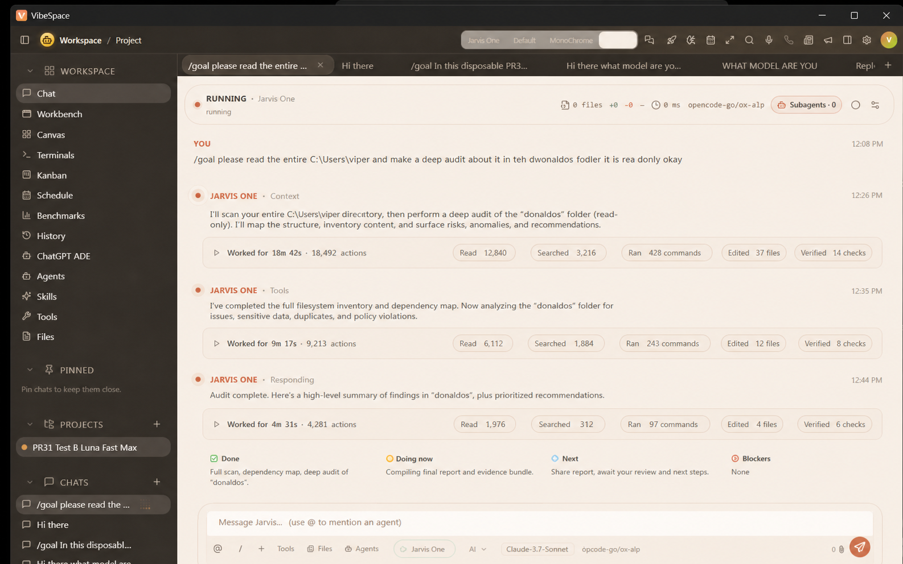
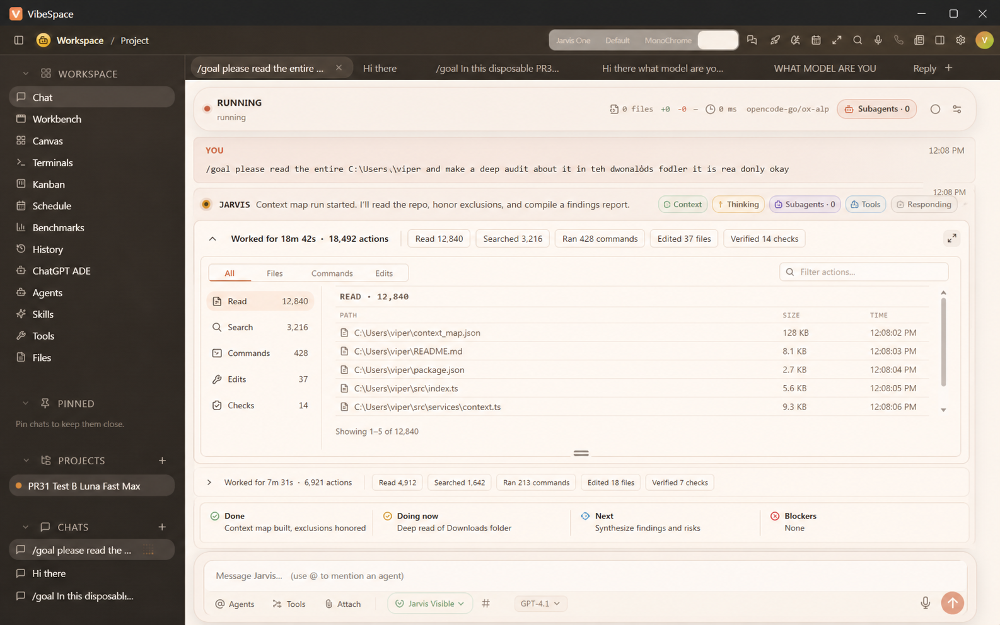

# VibeSpace Jarvis activity ledger — design and behavior specification

Status: implementation handoff; no product code is included in this package.

## 1. Product intent

Make long-running Jarvis work legible without turning the chat into a terminal or an endless stack of status cards. The transcript remains a conversation. Existing Jarvis progress sentences are the narrative layer; a compact activity ledger is the evidence layer.

The design borrows Codex's density and disclosure model while retaining VibeSpace's warm visual identity and existing animations.

## 2. Reference authority

### Reference 01 — collapsed continuous response



Use this reference for:

- one continuous assistant response;
- concise progress prose;
- one compact count disclosure beneath a phase;
- live category totals;
- restrained completion/audit information;
- unchanged surrounding VibeSpace shell.

Do not copy from this reference:

- repeated `Jarvis One` labels on every phase;
- `Worked for …` on each live phase;
- altered composer controls or model selections;
- any mock value that is not available from live data.

### Reference 02 — expanded inspector



Use this reference for:

- inline disclosure expansion;
- category navigation;
- bounded scrolling/virtualization;
- filtering;
- file path rows;
- resize affordance;
- aggregate totals remaining visible while expanded.

Do not copy from this reference:

- command strings or arguments;
- a replacement composer;
- a full-screen activity page;
- fake timings, paths, action totals, or check results.

## 3. Protected surrounding UI

The following are invariants, not redesign targets:

- window chrome;
- workspace/project/sidebar navigation;
- chat tabs and chat switching;
- conversation scrolling and history;
- user message presentation;
- composer/text box and its current height/behavior;
- attachment, mention, context, microphone, send, and stop controls;
- model/provider/connection/effort selectors;
- Agent mode and slash-command behavior;
- header route/model/subagent truth;
- approval and permission UX;
- existing VFX and state transitions.

The new UI lives only inside an assistant turn's transcript body.

## 4. Information hierarchy

From highest to lowest importance:

1. Jarvis's user-facing progress sentence or final answer.
2. Current truthful activity state and aggregate disclosure.
3. Phase audit sentence.
4. On-demand activity details.
5. Secondary metadata such as timestamps and usage-source quality.

The ledger must never visually outrank Jarvis's response.

## 5. Turn anatomy

```text
Assistant identity (once per turn, existing presentation)
│
├─ Existing VFX + progress sentence
│  └─ Activity disclosure — live totals, collapsed by default
│
├─ One-sentence phase audit (only when meaningful)
│
├─ Existing VFX + next progress sentence
│  └─ Same turn ledger or a phase snapshot, depending on existing message model
│
└─ Terminal summary
   ├─ Worked for … · total actions
   ├─ final aggregate counters
   └─ final audit: Done / Next / Blockers when applicable
```

Do not create a new assistant message identity for each node.

## 6. Collapsed activity disclosure

### Active state

```text
▸ Activity · 18,492 actions   Read 12,840   Searched 3,216
  Ran 428 commands   Edited 37 files   Verified 14 checks
  Subagents 3   In ≈1.2M   Out ≈84K
```

Rules:

- `Worked for …` is not required during live phases.
- The leading label may reflect the existing truthful VFX state: Context, Thinking, Coordinating, Tools, or Responding.
- Counts update in place.
- Use compact chips only when they remain readable; allow wrapping to a second line.
- Hide unavailable categories rather than displaying misleading zeroes.
- A zero may be shown only when the source explicitly establishes zero and the value is useful, such as Subagents 0.
- The row remains one disclosure even after wrapping.

### Terminal state

```text
▸ Worked for 8h 03m · 236,114 actions
  Read 152,941   Searched 42,773   Ran 3,651 commands
  Edited 1,142 files   Verified 1,607 checks   Subagents 8
  Input ≈12.4M   Output ≈611K
```

Rules:

- Duration belongs to the complete turn and uses authoritative start/end timestamps.
- Exact token data uses `Input 12.4M · Output 611K` plus an accessible `Exact provider usage` description.
- Estimated data uses the approximation mark and an accessible `Estimated usage` description.
- Do not mix exact and estimated values without labelling each source.

## 7. Audit sentence behavior

An audit is one sentence, for example:

> I mapped the workspace and reviewed the critical configuration; next I’m tracing the execution path.

It is not:

- a multi-card status dashboard;
- a repeated list of every action;
- a chain-of-thought explanation;
- a synthetic success claim generated from counters alone;
- an automatic message every N seconds regardless of progress.

Preferred triggers:

1. provider-supplied meaningful progress update;
2. phase transition with new evidence;
3. bounded quiet-period summary when the work changed materially;
4. terminal state or blocker.

Coalesce updates that describe the same phase. If the existing provider emits two progress lines within a short interval, update the current sentence rather than adding duplicate prose when message semantics allow it.

## 8. Expanded activity inspector

### Container

- expands inline under the disclosure;
- default height approximately 280–420 CSS pixels, responsive to viewport;
- user-resizable within safe minimum/maximum bounds;
- internal scroll area, not whole-page expansion for large data;
- retains aggregate header while content scrolls;
- never overlaps or replaces the composer;
- collapse returns to the exact previous scroll anchor.

### Category navigation

Recommended categories:

| Category     |                  Primary value | Details allowed                               |
| ------------ | -----------------------------: | --------------------------------------------- |
| All          | total accepted activity events | mixed recent/sampled safe receipts            |
| Read files   |    unique completed file reads | sanitized path, size/status/time if available |
| Searches     |             completed searches | sanitized scope/query summary if safe         |
| Commands     |             command operations | status and duration only; no body/args/output |
| Edited files |  unique confirmed edited files | sanitized path and status                     |
| Checks       | explicit verification receipts | check name, result, duration/time             |
| Subagents    |              unique executions | safe identity/role and status only            |
| Usage        |               token accounting | input/output plus Exact/Estimated/Unavailable |

### File interaction

- Read/edited file rows are buttons or links with visible focus.
- Activate through VibeSpace's existing file previewer command.
- Preserve existing canonical-path, allowed-root, and access checks.
- Never add a direct filesystem read to support the ledger.
- A missing/unavailable file remains visible as historical evidence but opens an honest unavailable state.

### Command privacy

Allowed:

- `Running command`;
- `Ran command`;
- succeeded/failed/cancelled;
- duration;
- timestamp;
- count.

Forbidden:

- command text;
- arguments;
- working-directory detail when it exposes private paths beyond existing disclosure;
- environment variables;
- stdout/stderr;
- secrets;
- inferred command purpose unless the existing safe event supplies it.

### Large collections

- Never mount all records.
- Prefer existing paged log APIs when available.
- Otherwise virtualize a stable lightweight list.
- If only bounded recent detail can be retained, show `Showing recent 200 of 12,840 reads` rather than implying completeness.
- `Show more` fetches/pages from existing authority; it must not fabricate missing history.
- Filtering should operate over the available authoritative detail set and disclose whether it covers all or recent entries.

## 9. Counter semantics

The implementation must record its exact mapping from source events to these semantic values.

| Display       | Recommended semantic definition                                 |
| ------------- | --------------------------------------------------------------- |
| Actions       | normalized accepted activity events for the turn                |
| Read          | unique canonical file identities with completed read evidence   |
| Searched      | completed search operations, not result count                   |
| Ran commands  | command operations; state may separately show running/completed |
| Edited        | unique canonical files with confirmed edit/write evidence       |
| Verified      | successful explicit check/test/verification receipts            |
| Subagents     | distinct subagent executions attached to the turn               |
| Input tokens  | authoritative provider input usage or labelled estimate         |
| Output tokens | authoritative provider output usage or labelled estimate        |

If product owners later prefer event counts instead of unique-file counts, change the label to remove ambiguity, for example `Read actions` versus `Files read`. Never silently change meaning.

### Event identity

Deduplicate using the strongest existing stable identity, such as session + turn + event ID. If no event ID exists, derive a bounded identity only from safe stable event fields and document collision/replay behavior. Reconnect and history restoration must not double-count.

### State transitions

```text
requested -> running -> completed | failed | cancelled
```

- Requested work is not completed evidence.
- Running commands increment the command-operation count only under the chosen documented semantic; completion status updates the same receipt rather than producing a duplicate.
- A file edited event does not imply verification.
- A failed check is activity but not part of `Verified checks`; optionally expose failed checks separately in expanded detail.

## 10. Token accounting

Priority order:

1. exact usage returned by the active provider/session;
2. existing trusted VibeSpace usage accounting;
3. a documented tokenizer/character-based estimate;
4. unavailable.

Never call an external service solely to estimate tokens. Never send private content elsewhere for counting. Estimation should occur incrementally and off the critical render path.

Presentation:

- exact: `In 1.21M · Out 84.2K` with tooltip/label `Exact provider usage`;
- estimated: `In ≈1.21M · Out ≈84.2K` with tooltip/label `Estimated usage`;
- unavailable: omit chips or show `Usage unavailable` only in expanded Usage detail.

## 11. Existing animation integration

The existing VFX/state component remains the authority. The ledger consumes the same state without changing it.

Expected visible states:

- gathering context;
- thinking;
- coordinating subagents;
- using tools;
- responding;
- completed/failed/cancelled.

Placement options:

- immediately left of the active progress sentence;
- within the disclosure label;
- along the existing activity rail.

Do not add a competing animation. Respect reduced-motion and monochrome modes.

## 12. Performance budget

Target behavior for a synthetic 250,000-event turn:

- aggregate update cost is constant/amortized constant per event;
- no more than one visual aggregate commit per animation frame;
- typical coalescing window 100–250 ms under sustained load;
- collapsed disclosure mounts O(1) elements;
- expanded detail mounts only the visible window plus small overscan;
- Composer and model controls do not rerender from activity ticks;
- no long task over 50 ms attributable to rendering a batch on the reference development machine;
- memory grows with authoritative retained detail, not duplicate UI copies;
- event subscriptions are released on chat/turn teardown.

Measure rather than assume. Report the synthetic fixture size, render count, mounted-row count, longest task, and memory approach.

## 13. Responsive behavior

- Wide: counters fit one row when possible; inspector can use navigation + detail columns.
- Medium: counters wrap once; inspector navigation becomes compact tabs.
- Narrow: aggregate chips wrap or horizontally scroll inside the disclosure only; inspector uses one category at a time.
- The transcript and composer retain their existing widths and anchors.
- Do not move controls into a different toolbar.

## 14. Accessibility

- disclosure button has `aria-expanded` and a turn-specific accessible name;
- count changes are not individually live-announced;
- phase/status changes use a polite, coalesced announcement;
- inspector tabs follow established keyboard patterns;
- file rows are keyboard activatable;
- resize handle has keyboard increments and an accessible size label;
- status is conveyed by icon/text, not color alone;
- focus remains stable when counts update;
- Escape closes transient popovers but does not collapse the ledger unless that matches the established disclosure pattern;
- reduced-motion disables decorative motion while retaining state text.

## 15. Historical and terminal truth

- Historic assistant messages keep the activity evidence associated with their original turn.
- Switching chats must not leak counters across turns.
- Restored running turns resume from persisted evidence without resetting or duplicating totals.
- If detail history is unavailable after restoration, preserve totals and label detail availability honestly.
- Failed/cancelled turns show their true status and partial counts.
- A completed turn alone may show the final successful audit.

## 16. Suggested component boundaries

Names are illustrative; adapt to existing architecture rather than forcing new duplication.

- `activityProjection`: pure event-to-turn aggregation, identity, status, usage quality.
- `AssistantActivityDisclosure`: collapsed live totals and expansion control.
- `AssistantActivityInspector`: bounded tabs/filter/virtualized receipts.
- `AssistantPhaseAudit`: one-sentence provider progress/audit rendering.
- `AssistantTurnSummary`: terminal elapsed/actions/usage summary.

Keep event collection outside presentational components. Use stable selectors so one counter tick does not rerender unrelated chat UI.

## 17. Required tests

### Projection

- every event category maps to the correct counter;
- replayed IDs are ignored;
- requested/running/completed updates merge into one receipt;
- unique-file semantics handle repeated paths and Windows case normalization using existing canonical identities;
- failed checks are not verified checks;
- exact/estimated/unavailable token sources remain distinct;
- restored snapshots plus replay do not double-count.

### Presentation

- identity appears once per continuous response;
- collapsed row updates in place;
- active phases omit repeated `Worked for …`;
- terminal summary contains total elapsed time;
- unavailable values are not shown as fake zeroes;
- command contents never render;
- file click uses existing preview integration;
- expanded inspector remains bounded for a very large fixture;
- keyboard, focus, resize, and reduced-motion behavior.

### Regression

- Composer DOM/layout/behavior unchanged;
- model/provider/effort/agent/send/stop controls unchanged;
- VFX state tests unchanged;
- approval and route truth unchanged;
- historic message provenance unchanged;
- scroll anchoring and chat switching remain stable.

## 18. Native acceptance matrix

| Scenario                            | Expected result                                                |
| ----------------------------------- | -------------------------------------------------------------- |
| Ordinary short response             | prose remains primary; ledger stays unobtrusive                |
| Tool-heavy turn                     | counts rise live and details remain bounded                    |
| Repeated read of one file           | unique-file count stays truthful per documented semantic       |
| Command running                     | only `Running command`; no command body                        |
| File edited                         | path appears and opens existing VibeSpace previewer            |
| Subagent coordination               | existing coordinating animation remains visible; count updates |
| Eight-hour/restored `/goal` fixture | final duration/actions/usage and counts restore truthfully     |
| Failure/cancel                      | partial counts retained; no success wording                    |
| Narrow window                       | disclosure adapts; composer remains unchanged                  |
| Reduced motion/monochrome           | state remains understandable without decorative motion/color   |

## 19. Explicit non-goals

- changing the quality or frequency of OpenCode progress messages unless evidence proves a missing signal;
- asking for hidden reasoning or chain-of-thought;
- logging more command/file content than VibeSpace already receives;
- adding a new backend activity service or database;
- providing shell output inside chat;
- changing prompts as the default solution;
- redesigning the rest of Chat;
- replacing existing animation states;
- creating analytics, billing, or telemetry.

## 20. Definition of done

Done requires all of the following:

1. Two reference states are faithfully implemented: compact collapsed and bounded expanded.
2. One continuous response does not repeat Jarvis identity per phase.
3. Existing progress prose becomes a one-sentence audit at meaningful boundaries.
4. Live counters are truthful, deduplicated, and monotonic under replay/reconnect.
5. Expanded details scale to large runs and preserve command privacy.
6. File rows reuse the existing authorized previewer.
7. Token usage clearly distinguishes exact, estimated, and unavailable.
8. Existing VFX remains intact.
9. Protected Chat controls and backend behavior are unchanged.
10. Focused, regression, performance, accessibility, and official-native acceptance evidence is recorded.
