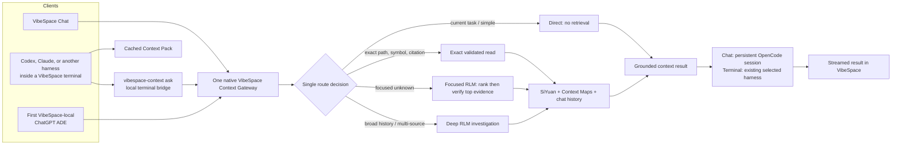

# VibeSpace Unified Chat, Terminal, ADE, RLM, and SiYuan Merge Plan

**Document type:** Implementation-ready architecture, migration, performance, and acceptance plan
**Status:** Proposed plan — no runtime behavior is changed by this document
**Target:** Current `integration/UnifiedChungus-final` PR31 worktree
**Purpose:** Merge the existing VibeSpace Chat/OpenCode/RLM/SiYuan design with a native, no-MCP terminal context bridge and the first VibeSpace-local ADE adapter. The result is one simpler context system that works consistently for VibeSpace Chat, every compatible agent harness launched inside a VibeSpace terminal, and the first ChatGPT ADE.

> Terminology: the local knowledge service is **SiYuan**. RLM is the VibeSpace retrieval/reasoning coordinator; it is not a model provider and it does not replace OpenCode, Codex, Claude, or any other model harness.

## 1. Executive decision

Keep one authoritative VibeSpace Context Gateway. VibeSpace Chat and the first VibeSpace-local ChatGPT ADE use it directly; terminals use a native VibeSpace command that is automatically available in every VibeSpace-launched terminal. The Gateway chooses one of three internal paths—direct, focused evidence, or deep investigation—so neither the user nor the model must manage a maze of routers. Normal messages never wait for broad RLM research. Exact references read the exact source. Only broad, ambiguous, historical, sensitive, or multi-source tasks invoke deeper RLM. This preserves existing features and evidence safety while removing duplicate prompt assembly, duplicate retrieval, per-message cold work, and serial hydration of irrelevant search results.

**Implementation-status gate.** This document is a proposed implementation contract, not evidence that the final architecture exists. The checked-in PR31 candidate contains useful persistent OpenCode, Context Map, RLM, SiYuan, terminal-CLI, and Browser Chat pieces, but it does **not** yet contain one shared `ContextGateway`, the managed-terminal RLM bridge described here, or an ADE runtime. No phase may be called complete merely because a UI surface, static test, or plan text exists.



## 2. What changes, and what does not

### Current state

- Native VibeSpace Chat already has the intended persistent OpenCode/RLM direction: adaptive direct/retrieval/RLM routing, a high-level `vibespace_context.query` tool, pointer validation, streaming normalization, and connection-qualified model identity.
- VibeSpace Chat currently has more than one context path: pre-dispatch repository preparation and the high-level federated Context/RLM tool are separate implementations. They must become adapters behind the Gateway, not remain independent route authorities.
- VibeSpace terminal agent delivery creates a bounded, sanitized Context Pack containing active map summaries, pins, skills, coordination details, and project context. The existing `vibespace context ...` CLI searches persisted Context Maps; it is useful baseline context, but it is not a live RLM/SiYuan query capability or the scoped terminal bridge required here.
- The public VibeSpace MCP currently exposes only read-only filesystem-oriented operations and does not provide the terminal-to-RLM path requested here.
- The current source does not contain an ADE runtime to extend. The first **VibeSpace-local ADE** is therefore a future thin adapter contract, not a claim of an existing feature, a Browser Chat capability, or an external ChatGPT integration. It must snap into the completed background Gateway, policy, terminal, provider, and history systems rather than create a fourth subsystem.
- Current large-context safety mechanisms—project/account/worktree scope, pointer leases, source version/hash/range validation, cancellation, and no silent model/effort fallback—must stay in place.
- Existing provider failures are real external blockers, not architecture failures: an OAuth/API key error cannot be repaired safely by code without the account owner completing the official authorization flow.

### Final state

1. **One Context Gateway, not separate Chat, Terminal, and ADE context systems.**
2. **No new MCP server and no user setup.** The terminal bridge is a VibeSpace-owned local executable/IPC client, injected only into VibeSpace-managed terminal environments.
3. **Provider and harness independence.** The bridge works for Codex, Claude, OpenCode CLI, or another terminal harness that can execute a local command. It does not depend on the selected provider, model, or OpenCode session.
4. **One simple public terminal interface:** `vibespace-context ask "question"`. VibeSpace owns the internal route selection, caching, retrieval, evidence formatting, cancellation, and authorization.
5. **No full vault dump.** “Full access” means the terminal can request any authorized project context on demand. It does not mean copying the whole SiYuan database, raw history, credentials, or unrelated projects into a prompt.
6. **One required-versus-optional policy.** Chat, managed Terminal agent runs, and ADEs use the same evidence requirements; their UI differs, but safety and context semantics do not.

### Explicit non-goals

- Do not remove OpenCode, SiYuan, Context Maps, pointer validation, provider/model/effort identity, user permissions, streaming, cancellation, or any existing VibeSpace feature.
- Do not expose a listening public HTTP service, browser-accessible local context endpoint, provider credentials, or raw SiYuan authority to terminal processes.
- Do not promise that arbitrary third-party provider outages, rate limits, OAuth revocation, a machine crash, or a harness that cannot execute local commands can never produce an error. The product goal is automatic setup, clear recovery, no silent degradation, and verified reliability—not an unprovable “zero errors forever” claim.

## 3. Simplified runtime topology

### 3.1 The shared Context Gateway

The Gateway is a native VibeSpace service, not a second model process. It owns four internal operations:

| Operation      | Caller                                                       | Result                                                            | Why it exists                                                              |
| -------------- | ------------------------------------------------------------ | ----------------------------------------------------------------- | -------------------------------------------------------------------------- |
| `prepareTurn`  | VibeSpace Chat and terminal prompt delivery                  | Tiny route decision plus cached baseline context                  | Makes ordinary work fast without asking the model to orchestrate retrieval |
| `ask`          | Chat RLM tool or terminal bridge                             | Bounded grounded answer, citations, and optional evidence handles | Gives every caller one high-level context capability                       |
| `openEvidence` | Gateway internally, or a follow-up from an authorized caller | Revalidated selected evidence only                                | Avoids sending large blocks before they are needed                         |
| `cancel`       | Chat/terminal lifecycle                                      | Stops queued or active retrieval                                  | Prevents late answers and wasted local work                                |

Internally, the Gateway may use direct, focused, or deep retrieval. Externally, there is one reliable high-level operation. This is the “fewer gates” design: callers do not choose or manually sequence low-level search/open/expand calls.

**Single-owner rule.** `prepareTurn`, `ask`, `openEvidence`, and `cancel` must be owned by one native Gateway implementation. Existing chat repository preparation, the federated `vibespace_context.query` tool, Context Maps, SiYuan, history, and terminal packs become source adapters or consumers; none may make an independent final route decision. A caller may never invoke SiYuan/RLM directly, keep an ADE-only cache, or assemble a second evidence prompt.

Every Gateway result carries a safe `ContextReceipt`:

```text
receiptId, policyVersion, route, required/optional decision, decision reasons,
scope revision, source revisions, evidence handles, cache/single-flight status,
stage timings, cancellation generation, and safe failure category
```

The receipt contains no raw provider credential, reusable evidence lease, source content, or internal authentication material. It is the shared provenance link between Chat, a managed Terminal run, and a future ADE.

### 3.2 VibeSpace Chat path

```text
Send message
  → assign one turn ID and cancellation controller
  → build/reuse one context snapshot
  → Context Gateway prepareTurn
  → dispatch the exact selected connection/model/effort through persistent OpenCode
  → stream normalized events immediately to the VibeSpace UI
  → persist history/telemetry after the stream path is safe
  → complete or cancel the same turn ID
```

Required Chat behavior:

- One turn gets one route decision, one context snapshot, one provider dispatch, and one event stream.
- Duplicate sends, stale async results, and late events after cancellation are rejected by the same turn gate.
- Context persistence, analytics, and nonessential UI bookkeeping never block first visible streaming output.
- OpenCode stays the native VibeSpace Chat harness. It remains responsible for the provider connection/session/SSE transport; it does not own VibeSpace data, UI, permissions, or retrieval authority.
- Existing exact model, provider connection, effort, Fast, access, approval, attachments, Prompt Forge, token modes, tools, skills, agents, schedules, voice, history, and theme behavior remain intact.

### 3.3 Terminal path: embedded native bridge, no MCP

```text
VibeSpace creates or opens a terminal
  → attaches a terminal/session/project/worktree context identity
  → puts the VibeSpace bridge executable on that terminal's private PATH
  → supplies a revision-cached Context Pack with the initial agent prompt
  → launches the user-selected CLI/harness normally
  → agent may run: vibespace-context ask "..."
  → bridge uses authenticated local IPC to the Context Gateway
  → terminal receives bounded cited evidence
```

The bridge must use a native, private IPC mechanism such as a named pipe or a Tauri-owned local command channel. It must not require the user to install an MCP plugin, choose a port, copy a token, or configure each harness. The session identity is minted by VibeSpace at terminal creation and is bound to the workspace, project, worktree, access profile, agent run, and expiry. It must not contain a reusable provider credential or grant access outside that terminal’s authorized scope.

At launch, VibeSpace provides a compact instruction saying that `vibespace-context ask` is available and must be used for cross-source/history/unknown-context work. The model still uses normal filesystem tools for the current checkout. This makes the bridge harness-independent while avoiding a hidden, expensive RLM request on every shell command.

If a harness cannot invoke local commands, it can receive the normal Context Pack but cannot have live RLM capability. That is a hard capability limit of the harness, not a reason to weaken the VibeSpace security boundary. All supported VibeSpace terminal agents must be tested for command execution before being labelled “RLM enabled.”

### 3.4 ADE path: the first VibeSpace-local ChatGPT ADE

An **ADE** in this plan is a VibeSpace-hosted agent-development environment adapter: a focused agent surface that has its own user interaction, task lifecycle, and capability policy, while reusing VibeSpace’s authority, context, terminal, and streaming systems. The first scope is a **VibeSpace-local ChatGPT ADE**. It is not a claim that a public ChatGPT.com plugin or external ChatGPT app already exists.

The first ADE adapter uses the Context Gateway directly, rather than copying the terminal implementation:

```text
User starts a ChatGPT ADE task in VibeSpace
  → ADE creates task/run identity and declared task risk
  → Context Policy evaluates the request before model dispatch or a write-capable action
  → optional direct context, or required focused/deep context when policy says so
  → selected ADE model/harness receives compact cited evidence and the same terminal-control capability policy
  → task streams into the ADE UI and its linked VibeSpace Chat/terminal records
```

The ADE may expose a terminal pane, but it does not receive a special unrestricted terminal. It uses the same VibeSpace terminal session identity, access profile, cancellation, context bridge, and permission controls as Terminal. This prevents three separate versions of terminal control, RLM rules, and evidence authority.

The ADE adapter contract is intentionally small:

| Contract field                                                          | Meaning                                                                                             |
| ----------------------------------------------------------------------- | --------------------------------------------------------------------------------------------------- |
| `adeId`, `runId`, `accountId`, `workspaceId`, `projectId`, `worktreeId` | Stable identity and scope for every request                                                         |
| `selectedHarness` and exact model identity                              | The ADE does not silently replace the user’s chosen provider/model/effort                           |
| `accessProfile`                                                         | Read/write/full permissions and approval ceiling inherited from VibeSpace                           |
| `contextPolicy`                                                         | `optional`, `required-focused`, or `required-deep`, decided from task risk and explicit user intent |
| `terminalSessionId`                                                     | Optional linked VibeSpace terminal; never an unrestricted shell grant by itself                     |
| `provenance`                                                            | Route, source revisions, evidence handles, timing, cancellation, and safe error state               |

The first ADE must tell its agent **when** context is required through structured policy metadata, not merely a long natural-language reminder. It may also present a short human-readable instruction: “Use VibeSpace Context before broad, sensitive, ambiguous, or explicitly evidence-required work.” The policy gate—not prompt compliance alone—is the authority for managed ADE actions.

No ADE work is a prerequisite for Gateway delivery. Until this adapter is implemented, every ADE acceptance row remains `NOT IMPLEMENTED`; Browser Chat must not be reclassified as passing ADE coverage. Once implemented, an ADE consumes `ContextReceipt`, `ExecutionIdentity`, terminal-session linkage, and existing action dispatchers exactly as Chat does. It adds presentation and task lifecycle only.

#### External ChatGPT integration boundary

This first ADE remains inside VibeSpace specifically to satisfy the no-MCP/no-user-setup requirement. If a later release means a public ChatGPT-hosted plugin, that is a separate external integration: it cannot directly access VibeSpace’s local SiYuan database or named-pipe bridge. It needs its own reviewed remote authentication and transport design. Current official OpenAI plugin guidance describes Plugins/Apps around an MCP server, so that future external scope must be planned separately rather than quietly turning the private terminal bridge into a public endpoint. [OpenAI Developers plugin documentation](https://developers.openai.com/plugins)

## 4. Route policy: quality first, no unnecessary research

| User/task signal                                                 | Gateway action | Typical evidence                                      | RLM cost policy                          |
| ---------------------------------------------------------------- | -------------- | ----------------------------------------------------- | ---------------------------------------- |
| Current file, simple question, normal chat, known task           | Direct         | Context Pack/current visible state only               | No SiYuan search                         |
| Exact file path, symbol, block ID, citation, task ID             | Exact read     | One source, validated before use                      | No broad ranking                         |
| “Where is this implemented?” or a focused unknown                | Focused RLM    | Search summaries, then top 3–5 candidates             | One high-level request, bounded evidence |
| Prior decisions, multiple projects/sources, audit, contradiction | Deep RLM       | Planned subqueries, selected source opens, provenance | Explicitly observable and cancellable    |

The decision must be deterministic enough to test and visible in Dev Console as `direct`, `exact`, `focused`, or `deep`. The user sees a simple status such as “Using project context” only when useful; they are not asked to operate routing controls. `/rlm` and `/performance` remain advanced controls, not required setup steps.

### 4.1 When context is optional and when it is required

RLM/SiYuan is a tool, not mandatory overhead for every message. It becomes required when evidence is materially necessary to preserve quality, safety, or user intent.

| Situation                                                                                                                                                                                  | VibeSpace Chat                                                    | Managed Terminal agent run                                                                          | ChatGPT ADE                                                               |
| ------------------------------------------------------------------------------------------------------------------------------------------------------------------------------------------ | ----------------------------------------------------------------- | --------------------------------------------------------------------------------------------------- | ------------------------------------------------------------------------- |
| Simple current-file task, ordinary conversation, or an exact local reference already open                                                                                                  | Optional; direct route is preferred                               | Optional; Context Pack plus normal filesystem is sufficient                                         | Optional; direct route is preferred                                       |
| User explicitly asks to use context, RLM, deep thinking, a no-error audit, prior decisions, or cross-source reasoning                                                                      | Required focused/deep route before answer or action               | Required `vibespace-context` preflight before substantive answer/action                             | Required focused/deep policy before answer or action                      |
| Broad repository change, unfamiliar subsystem, multi-package/worktree impact, or unclear blast radius                                                                                      | Required focused route; deep if evidence remains incomplete       | Required preflight before a managed write-capable run receives its work instruction                 | Required policy gate before proposing or making a change                  |
| Authentication, credentials, permissions, billing, subscriptions, database/schema migration, release/signing, destructive data action, security finding, or production-impacting operation | Required context evidence plus existing permission/approval gates | Required preflight and existing permission/approval gates; no context result grants extra authority | Required deep or focused evidence plus existing permission/approval gates |
| The agent independently needs project history, Context Maps, SiYuan knowledge, or a fact outside its current checkout                                                                      | Available on demand                                               | Available on demand through the terminal bridge                                                     | Available on demand through the direct Gateway adapter                    |

For **VibeSpace Chat**, this is enforced before provider dispatch by `prepareTurn` and the existing context/tool authority. For a **managed VibeSpace terminal agent run**, the launcher must run the policy preflight before granting the run its planned write-capable instruction. A person manually typing an arbitrary external CLI command cannot be made safe by a prompt alone; it receives the bridge and warnings, while fully enforceable mandatory use applies to VibeSpace-managed agent runs. For the **ADE**, the adapter owns the action dispatcher, so it can enforce the policy before any model-backed write/tool request.

### 4.2 Context Policy is an executable gate

The policy must be implemented as one deterministic, versioned function; keyword matching may assist classification but is never the sole authority. It receives the account/workspace/project/worktree/access scope, declared task/action kinds, user request for context/audit/deep thinking, current working-set evidence, risk domains, and Gateway availability. It returns a `ContextReceipt` or a safe block.

| Decision                      | Required behavior                                                                                                                                                                                                 |
| ----------------------------- | ----------------------------------------------------------------------------------------------------------------------------------------------------------------------------------------------------------------- |
| `optional-direct`             | Current-file/simple/known work may dispatch with no retrieval after a ≤150 ms prepare decision.                                                                                                                   |
| `required-focused`            | Explicit context/audit/no-error request, unfamiliar or broad change, cross-source/history question, or incomplete working-set evidence must receive bounded validated evidence before a managed answer or action. |
| `required-deep`               | Auth, credentials, permissions, billing/subscriptions, migration, release/signing, destructive work, security, or unresolved multi-source contradiction requires the deep route and existing approval gates.      |
| `blocked-context-unavailable` | A required route that cannot obtain authorized context must block the managed write/action with a truthful recovery state. It must not silently become direct or retrieval-only.                                  |

`/rlm off` controls optional enrichment only. It must never downgrade a required-focused or required-deep decision. Managed write/tool dispatchers must verify the current, scope-bound receipt before dispatch; a model instruction, an empty tool call, or a manually typed shell command is not proof. This gives Chat, managed Terminal runs, and a future ADE one real gate while preserving the explicit boundary for arbitrary external shells.

### 4.3 Exact execution identity is separate from context

Every selectable and dispatched model route must carry one immutable `ExecutionIdentity`:

```text
transportConnectionId, transportAdapterId, upstreamProviderId, upstreamModelId,
providerQualifiedModelId, auth/billing route, supported effort/fast variant,
catalog revision, and observed provider identity
```

The picker may group a provider-qualified OpenCode route under a friendly provider label, but it must not persist the generic `opencode` transport as the upstream provider. Dispatch, route disclosure, acknowledgement, usage, telemetry, and error recovery use the same identity. A model absent from the current authenticated live catalog fails clearly; static labels are never execution authority and no route may substitute a provider, model, Fast mode, effort, or billing path.

## 5. Performance architecture and the 20% requirement

### 5.1 Honest performance contract

The requested “no more than 20% slower on every model request regardless of provider” cannot be truthfully guaranteed as a literal per-request total-time rule. A provider can return in 100 ms, queue for minutes, throttle, disconnect, or change latency independently of VibeSpace. Deep evidence retrieval also necessarily takes longer than no retrieval.

The enforceable product contract is therefore:

1. **Normal direct requests:** VibeSpace Chat, managed Terminal runs, and ADE-added warm overhead must be no more than the lesser of **20% of the same harness/provider baseline** and **150 ms p95** (250 ms p99) in a controlled rolling measurement. This is the strict user-facing target for normal work after cold startup.
2. **Focused context requests:** Local retrieval has a p95 target of **4 seconds** before provider dispatch, with top-3 evidence, not 20 serial candidate hydrations.
3. **Deep investigations:** Their initial grounded evidence pack has an **8 second p95** target and a **10 second hard pre-dispatch deadline**. If further evidence is needed, the same Gateway continues it through the cited tool/receipt loop after initial provider dispatch; it is explicit, cancellable, and never represented as a completed deep investigation before the evidence exists.
4. **Provider, network, model thinking, and provider queue time:** measured and reported separately. They never count as hidden VibeSpace overhead.
5. **Cold native startup:** up to the existing allowed 120 seconds may occur once. It is excluded from warm-request SLOs; VibeSpace then keeps the active project’s SiYuan path warm.

This is stricter and more useful than pretending a 20% total-time guarantee can control an external provider. It guarantees that VibeSpace itself does not become the repeated source of delay.

### 5.2 Target timing budget after cold startup

| Stage                                        | Normal direct request target | Focused context target | Deep investigation target |
| -------------------------------------------- | ---------------------------: | ---------------------: | ------------------------: |
| Cached Context Pack / `prepareTurn`          |                   ≤50 ms p95 |             ≤50 ms p95 |                ≤50 ms p95 |
| Gateway route decision                       |                   ≤25 ms p95 |             ≤25 ms p95 |                ≤25 ms p95 |
| Queue wait                                   |                   ≤25 ms p95 |            ≤250 ms p95 |               ≤500 ms p95 |
| SiYuan search + initial evidence preparation |                         none |               ≤4 s p95 | ≤8 s p95 / ≤10 s deadline |
| Chat/terminal bridge dispatch                |                   ≤50 ms p95 |             ≤50 ms p95 |                ≤50 ms p95 |
| ADE policy/adaptor dispatch                  |                   ≤50 ms p95 |             ≤50 ms p95 |                ≤50 ms p95 |
| Provider first token / full completion       |            external baseline |      external baseline |         external baseline |

For a simple new message after cold startup, the VibeSpace portion should normally be **under 150 ms p95** for Chat, a managed Terminal run, or the first ADE; total visible first-token time is then dominated by the chosen provider/harness. The ADE must call the same gateway directly, not add a second retrieval pass. A new project scope may need a warm OpenCode session; retain two warm scopes only after measured memory safety confirms it.

The performance report must distinguish this Gateway overhead from provider/network/model-thinking time. It must also state when a focused/deep route is an intentional exception to normal-direct timing. A provider baseline shorter than the absolute target still uses the stricter 20% comparison; no chart may hide the relative result behind a favorable 150 ms number.

### 5.3 How the latency is removed safely

1. **Warm once, not every request.** Start SiYuan after active-project selection in the background; reuse the managed process until normal idle eviction/shutdown.
2. **Revision-cache Context Packs.** Rebuild only when project/worktree, maps, pins, skills, coordination, access profile, or context revision changes.
3. **Cache immutable safe work.** Cache search rankings and validated content by project + source revision. Never cache or share an agent’s evidence authority token.
4. **Single-flight identical queries.** If Chat, Codex, and Claude ask the same project-scoped question concurrently, perform one backend lookup and issue separately scoped results.
5. **Rank before hydrate.** Search summaries first. Validate and hash only the likely top 3–5 sources; exact identifiers open only their one target.
6. **Bounded same-project read concurrency.** Keep project switching, writes, and ownership-changing work serial; allow a small tested read pool of 2–4 for independent reads inside the same project.
7. **Progressive evidence.** First return the compact answer/citations. Open larger selected blocks only on need.
8. **Persistent OpenCode sessions.** Reuse the managed OpenCode server and per-chat session. Never start one OpenCode process per message.
9. **Stream before background bookkeeping.** The Chat UI paints provider events without waiting for history indexing or analytics persistence.
10. **No ADE duplication.** An ADE reuses the same Context Pack cache, query cache, route decision, evidence handles, cancellation, and timing trace. It must not keep a second SiYuan client, RLM planner, or terminal-control protocol.

The current 45-second SiYuan search timeout remains a failure ceiling, not an expected per-search cost. It must not be blindly lowered; instrumentation and measured percentiles decide later timeout changes.

## 6. Quality, authority, and feature-preservation rules

### 6.1 Evidence safety

- Every read is bound to account, workspace, project, worktree, access profile, source version, byte range, content hash, and a short-lived lease.
- Forged, stale, cross-project, cross-account, never-issued, hybrid, out-of-range, or cancelled evidence references fail closed.
- A cached source block may be shared internally only after source-version validation. Each caller receives a newly minted, caller-scoped evidence handle.
- Source content is data, never instructions. Context retrieval does not grant terminal execution, browser, credential, billing, or mutation authority.

### 6.2 Provider and model truth

- The live authenticated connection-qualified catalog remains execution authority.
- The selected provider, connection, model ID, effort level, Fast setting, access mode, and approval mode must be observed at dispatch or the turn fails clearly.
- Static catalogs are display fallbacks only; they cannot silently execute a different route.
- The terminal context bridge never selects, replaces, downgrades, or authenticates a model. It only provides scoped context to the harness already chosen by the user.
- UI selection is insufficient proof. Native acceptance captures the observed `ExecutionIdentity` at dispatch and completion, including Fast and reasoning-variant support, and compares it to the live catalog selection. A label or toggle without matching observed route data is a failure.

### 6.3 Existing feature preservation

The unified Context Gateway must preserve all current VibeSpace surfaces: attachments, images, Prompt Forge, token modes, visible terminals, files, Git, browser permissions, plugins/MCP, skills, schedules, agents/subagents, All About Me, Learning, voice, history, undo/redo, usage, offline local models, themes, accessibility, and Browser Chat isolation. The first ADE is an additional adapter over those systems; it must not fork, hide, or weaken them. Migration is complete only when functionality—not just visible controls—continues to work with correct permissions, cancellation, restart/recovery, and error behavior.

## 7. Reliability and failure behavior

### Required recovery rules

| Failure                                  | Required behavior                                                                                                  |
| ---------------------------------------- | ------------------------------------------------------------------------------------------------------------------ |
| SiYuan is still starting                 | Show local-context readiness; do not hang the provider/UI indefinitely; retry only under bounded supervisor policy |
| One stale same-project native bridge     | Perform one safe same-project rebind/retry; otherwise return a clear context-unavailable status                    |
| Retrieval exceeds budget or is cancelled | Stop work, invalidate pending result, preserve the user’s turn and allow normal retry                              |
| Provider/OAuth/API-key failure           | Show the actual safe category and official reconnect path; never substitute a provider/model or scrape credentials |
| Terminal bridge unavailable              | Keep the normal Context Pack, report the bridge state, and do not pretend evidence was retrieved                   |
| OpenCode session/runtime restart         | Reconstruct the VibeSpace-visible session mapping safely; reject late events from the old generation               |
| Cache revision changes                   | Invalidate affected cache entries; reissue evidence handles after revalidation                                     |

### Existing external blockers

The existing Codex/OpenCode OAuth 401 and Qwen credential 401 must be resolved with the account owner’s official reauthorization or valid credential. The implementation must make these failures truthful and recoverable, but cannot securely “fix” credentials by guessing, copying, or bypassing authentication.

## 8. Delivery sequence

### Phase 0 — Baseline and acceptance harness

1. Record native-app baseline traces for Chat direct, focused, deep, and terminal runs.
2. Record direct harness/provider baselines separately from VibeSpace measurements.
3. Repair existing provider authentication only through official user-owned flows.
4. Normalize and test `ExecutionIdentity` before any Gateway migration: transport and upstream provider identity, exact qualified model ID, billing/auth route, effort/Fast support, acknowledgement key, usage, and observed completion identity.
5. Freeze a representative corpus, source-revision set, and quality rubric before optimizations.

### Phase 1 — Shared Context Gateway contract

1. Define the native Gateway request/response contracts and route-decision reasons.
2. Refactor Chat to call the Gateway through its existing high-level RLM tool path, without changing feature behavior.
3. Add turn ID, cancellation, source revision, provenance, and error-state contracts.
4. Add the shared required-versus-optional Context Policy and focused tests for all route choices, scope boundaries, stale evidence, cancellation, exact identifiers, and sensitive-operation triggers.
5. Add receipt verification to every managed write/action dispatcher. A required-context failure blocks the action and does not fall back when RLM is disabled or unavailable.

### Phase 2 — Native terminal bridge

1. Create the VibeSpace-owned bridge executable/client and private native IPC transport.
2. Inject it automatically only into VibeSpace terminal environments.
3. Bind each bridge invocation to terminal/project/worktree/access/session authority.
4. Deliver the revision-cached Context Pack plus the one-command agent instruction.
5. Verify Codex, Claude, OpenCode CLI, and every supported harness can use it without provider-specific setup.
6. Replace environment-derived project selection as authority with an app-minted, expiry-bound terminal/run identity. It includes account, workspace, project, worktree, access ceiling, run generation, and Gateway receipt binding; it never contains provider credentials.

### Phase 3 — First VibeSpace-local ChatGPT ADE

1. Define the ADE adapter/run schema and attach it to existing VibeSpace project, worktree, access, provider/model, terminal, and history records.
2. Connect the ADE directly to the shared Context Gateway and Context Policy; do not create ADE-specific RLM, SiYuan, cache, or terminal code.
3. Render route/provenance/status in the ADE without exposing raw evidence handles, secrets, or internal policy data.
4. Enforce required context for explicit user intent, broad changes, high-risk domains, and sensitivity triggers before ADE write/tool actions.
5. Verify the ADE can optionally link a VibeSpace terminal, inherit the same access ceiling, cancel together, and never cross project/worktree scope.
6. Until all five prior items exist and pass native acceptance, publish the ADE state as `NOT IMPLEMENTED`, not partial or Browser Chat coverage.

### Phase 4 — Latency removal

1. Add stage-level timings and queue-depth telemetry with no prompts, source content, or secrets in logs.
2. Implement revision caches and single-flight lookup coalescing.
3. Replace broad candidate hydration with ranked top-3/top-5 verification.
4. Add bounded same-project read concurrency behind cancellation and generation checks.
5. Add active-project SiYuan prewarm and measured two-scope OpenCode warming if memory allows.

### Phase 5 — Feature parity and native acceptance

1. Run the complete provider/model/effort, tools, permissions, attachments, skills, schedules, agents, terminal, offline, history, and UI regression matrix.
2. Run official native VibeSpace manual verification only; browser-preview testing does not prove PTY, local IPC, keyring, or SiYuan behavior.
3. Run simultaneous Chat + Codex + Claude isolation tests in distinct projects and worktrees.
4. Verify no cross-scope context, no duplicate provider dispatch, no hidden fallback, no late post-cancel event, and no raw secret in logs or output.

### Phase 6 — Controlled rollout and rollback

1. Keep the old internal path available only as a developer rollback during staged acceptance; never duplicate paid provider calls in shadow mode.
2. Enable the new Gateway for native development after its matrices pass.
3. Preserve chats, maps, skills, schedules, terminal history, provider metadata, and user settings throughout migration.
4. On a material regression, disable the new route, preserve all user data and journals, and restore the prior managed runtime pointer without deleting credentials or content.

## 9. Measurement and acceptance matrix

### Required timing fields

For every measured turn, record only safe metadata:

```text
route decision
context-pack cache hit/miss
SiYuan ready time
queue wait
search duration
candidate count / hydrated count
validation and hash duration
RLM subquery count
OpenCode or terminal-harness dispatch
provider accepted
first reasoning/text event
first visible UI paint
completion
cancel/retry state
CPU, memory, process count
same-harness direct baseline identifier
Gateway receipt identifier and policy version
observed exact execution identity
```

### Required test categories

| Category          | Minimum proof                                                                                                                                                              |
| ----------------- | -------------------------------------------------------------------------------------------------------------------------------------------------------------------------- |
| Direct Chat       | 30 warm comparable runs per selected harness/model; p50/p95/p99 VibeSpace overhead against direct baseline                                                                 |
| Focused retrieval | Exact and fuzzy lookup; top-result accuracy, citations, p95 retrieval duration, cancellation                                                                               |
| Deep RLM          | Multi-source answer quality, source provenance, budget exhaustion, cancellation, restart/reissue                                                                           |
| Terminal bridge   | Codex, Claude, OpenCode CLI, and all supported terminal agents receive Context Pack and successful scoped `ask` results                                                    |
| ChatGPT ADE       | Direct Gateway use, required-versus-optional policy, terminal linking, exact model/harness identity, cancellation, and no duplicated context work                          |
| Isolation         | Concurrent agents in separate projects/worktrees cannot see or reuse each other’s context/evidence handles                                                                 |
| Chat lifecycle    | New chat, resumed chat, project switch, cancellation, reconnect, stale event rejection, visible streaming                                                                  |
| Provider truth    | Exact connection/model/effort/Fast route observed; 401/reconnect behavior is explicit; no substitution                                                                     |
| Feature parity    | Existing VibeSpace capability matrix passes functionally, not just visually                                                                                                |
| Native QA         | Official desktop app manual test of PTY bridge, native SiYuan, OpenCode lifecycle, provider streaming, and recovery                                                        |
| Native fidelity   | Test uses the official VibeSpace desktop app only; no web preview, browser mock, static fixture, UI-only assertion, or fabricated trace may prove a native/provider result |

### Definition of done

This plan is implemented only when all of the following have evidence:

1. VibeSpace Chat, the first VibeSpace-local ChatGPT ADE, and all supported VibeSpace terminal harnesses use the same scoped Context Gateway.
2. Terminal users need no MCP installation, command configuration, provider-specific context setup, or manual context handoff.
3. Normal direct requests meet the defined 20%-over-baseline warm SLO and absolute p95/p99 overhead budgets.
4. Focused and deep routes meet their separate, explicit local retrieval budgets without quality regression.
5. The active provider/model/effort identity remains exact; no silent fallback occurs.
6. Pointer, project, worktree, account, permission, cancellation, and secret-redaction tests pass.
7. Existing VibeSpace Chat and terminal features pass the parity matrix, and the ADE adds no duplicate context, terminal, permission, or provider route.
8. Native desktop manual verification passes for the actual packaged/runtime environment.
9. External provider failures are either successfully reauthorized or reported as genuine external blockers; they are never masked as a completed system.
10. A final report records exact builds, commits, test results, timing distributions, memory/process measurements, remaining external blockers, and rollback notes.

## 10. Required native acceptance protocol

These runs are mandatory once the relevant implementation phase exists. They are deliberately defined as a fast interactive smoke followed by statistically meaningful warm measurements: one successful-looking request is never latency, quality, or provider proof. The official VibeSpace desktop app stays open for the entire run. Automation may control that native app only; web preview, browser automation, mocked provider responses, copied terminal output, and UI-state-only claims are prohibited.

### 10.1 Common preflight and evidence rules

1. Create/select the VibeSpace project rooted at `C:\Users\viper` only with existing secret, credential, system, cache, and unrelated-project filtering active. “Full access” never means copying the home directory or raw SiYuan vault into a prompt.
2. Create or refresh the project-scoped SiYuan Context Map, then visibly open the official SiYuan Context surface in VibeSpace. Record the map/project/revision and redacted readiness state; no screenshot or trace may expose a secret.
3. Record a baseline before each comparable run: exact build, app/runtime generation, project/worktree, Context receipt, model route, account route, Fast/effort capability, prompt hash, timestamps, and source revision.
4. Verify the exact live catalog route at dispatch and completion. A selected DeepSeek or OpenAI label alone is not evidence. If authentication, model availability, Fast support, or subscription authority is unavailable, record `BLOCKED_EXTERNAL` with the native error and do not substitute another route.
5. A test-discovered product bug creates a regression test, receives a general product fix, then reruns the affected native test and its relevant automated suite. Continue through independent failures; do not stop the full acceptance program for a minor UI issue. Do not add a user-specific prompt, cache, feature flag, timing exception, or hard-coded answer to make one run pass.
6. Continue until the acceptance gate passes or an external/safety blocker is documented. Provider 401/OAuth/API-key failures require the account owner’s official recovery step; they are never called a product pass and are never bypassed.

For this protocol, “RLM/SiYuan used correctly” means a required-policy `ContextReceipt`, project/worktree-bound evidence handles, source revision/provenance, and Gateway timings are present. It does **not** mean claiming that a model was retrained with RLHF; this plan validates VibeSpace RLM/SiYuan retrieval and evidence use only.

### 10.2 Test A — grounded 750-word context summary and latency comparison

Use this exact user request (normal punctuation only):

```text
C:\Users\viper Hi, please read your context and make me a 750-word summary of it in total.
```

1. Run the selected authenticated `DeepSeek V4 FLASH Vision Exp OpenCode Go` OpenCode route only if that exact route is live and authorized; otherwise record the truthful provider blocker.
2. Run a comparable direct-harness baseline inside a VibeSpace-managed terminal, then run VibeSpace Chat with the same model, project, prompt, and a required focused/deep Context Policy decision. The baseline and Chat run must be separate, timestamped receipts; neither may reuse the other answer.
3. Verify the VibeSpace Chat result is 650–850 words, grounded in multiple map areas, and contains valid source/provenance support. Grade factual coverage, citation validity, contradiction handling, and unsupported-claim rate against the frozen Context Map rubric—not style or word count alone.
4. The grounded Chat answer must score strictly higher than the direct baseline on that rubric. A tie, invented fact, missing required evidence, or lower grounded score is a regression to fix generally.
5. The normal-direct comparison must satisfy the strict ≤20% Gateway-over-baseline rule. Report focused/deep retrieval separately; it may not be hidden inside the direct timing result.
6. TIME TO BEAT (With Added 20 percent delay): 36 secounds Video Proof: "C:\Users\viper\Videos\Screen Recordings\Screen Recording 2026-08-22 094141.mp4" OUTPUT RESULT: "C:\Users\viper\Downloads\DEEPSEEK V4 FLASH ANSWER TO QUESTIO.txt" YOU MUST GET A BETTER RESULT THAN THIS IN ALL AERAS THATS THE OUTPUT YOU NEED TO BEAT OKAY MUST LOOP UNTIL WORKING!

### 10.3 Test B — GPT-5.6 Luna Max Fast write/read task

1. Use the user’s ChatGPT/Codex subscription route only if the live catalog exposes the exact GPT-5.6 Luna model and the requested Max/Fast capability. Observe the executed identity and Fast variant from the native provider/harness event; a visible Fast toggle without observed support fails.
2. In a disposable VibeSpace project subfolder, request a complete small custom HTML game. The task must require reading project context, creating and editing real files, validating the output in the VibeSpace terminal/file surface, and correcting any actual error discovered during the run.
3. The managed run is required-focused/deep when its task analysis crosses project context or write-risk boundaries. Verify the receipt before the first write, then verify actual file-action receipts, file contents, terminal validation, cancellation/recovery behavior, and final project isolation.
4. The run must not silently stop, claim writes it did not perform, downgrade the selected model/effort/Fast route, or invent test results. A real failure enters the fix-and-rerun loop from §10.1.

### 10.4 Test C — two managed VibeSpace terminals

1. Keep two VibeSpace terminal panes open, each with a distinct app-minted terminal/run identity. Launch the selected live OpenCode CLI route in a managed pane; use DeepSeek V4 Flash when authorized, otherwise the exact authorized GPT-5.6 Luna route.
2. Send the Test A summary request and explicitly require VibeSpace context. Verify that the launcher preflight produced a required receipt and that the harness obtains cited context through `vibespace-context ask`, not only a natural-language reminder or a stale Context Pack.
3. Verify the two panes cannot reuse each other’s receipt, evidence handle, project/worktree, authorization, cancellation generation, or output. Terminal tests prove live bridge behavior only when the native app, private bridge, and selected harness are actually running.

### 10.5 Measurement cadence and pass criteria

- Run a quick three-run native smoke for each available route while implementing, then 30 paired warm runs per selected harness/model before accepting the 20% SLO. Cold startup, network, provider queue, and provider thinking are reported separately.
- For every regression, preserve the failure receipt/trace, add the narrow automated regression coverage, fix the general cause, rerun the failed native scenario, and then rerun the affected matrix. Do not erase failure evidence.
- A run is a pass only when provider identity, policy receipt, context provenance, observed Fast/effort state where requested, user-visible streaming, actual file/terminal actions where requested, quality rubric, latency calculation, and cancellation/scope checks all agree.

## 11. Relationship to existing PR31 plans

This merge plan supplements, rather than replaces, the existing `docs/operations/VIBESPACE_OPENCODE_RLM_SYSTEM_REBUILD_PLAN.md` and PR31 acceptance/provenance records. That document remains the broad feature-parity, OpenCode runtime, provider, security, and release contract. This document adds the missing terminal-first native Context Gateway architecture, the first VibeSpace-local ChatGPT ADE adapter, a simpler caller interface, explicit required-versus-optional context policy, terminal harness support, and a concrete performance budget that treats normal messages differently from evidence-heavy investigations.

## Final implementation instruction

Implement this as a narrow unification of context transport and lifecycle management—not a UI redesign or destructive rewrite. Preserve all working product systems. Make VibeSpace Chat fast by default, grounded when required, and visibly streaming. Make every supported VibeSpace terminal harness context-capable automatically through one native bridge. Keep SiYuan local, RLM adaptive, OpenCode persistent for Chat, the ADE absent until it can snap into the completed Gateway as an adapter rather than a duplicate system, evidence scoped, models exact, and performance measured against direct baselines before claiming success.
